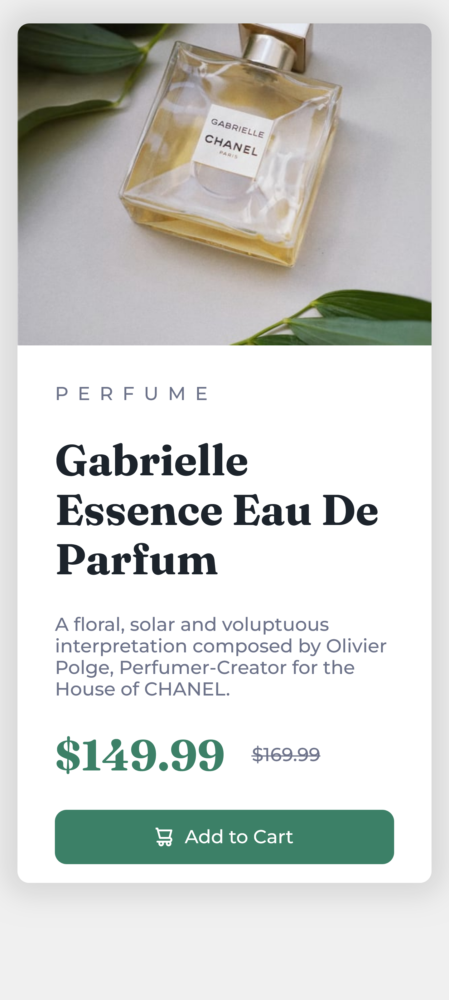

# Frontend Mentor - Product preview card component solution

This is a solution to the [Product preview card component challenge on Frontend Mentor](https://www.frontendmentor.io/challenges/product-preview-card-component-GO7UmttRfa). Frontend Mentor challenges help you improve your coding skills by building realistic projects. 

## Table of contents

- [Overview](#overview)
  - [The challenge](#the-challenge)
  - [Screenshot](#screenshot)
  - [Links](#links)
- [My process](#my-process)
  - [Built with](#built-with)
  - [What I learned](#what-i-learned)
  - [Continued development](#continued-development)
  - [Useful resources](#useful-resources)
- [Author](#author)
- [Acknowledgments](#acknowledgments)

**Note: Delete this note and update the table of contents based on what sections you keep.**

## Overview

### The challenge

Users should be able to:

- View the optimal layout depending on their device's screen size
- See hover and focus states for interactive elements

### Screenshot





### Links

- Solution URL: [Repository](https://github.com/YandroRB/product-card-component)
- Live Site URL: [Live Site](https://yandrorb.github.io/product-card-component/)

## My process

### Built with

- Semantic HTML5 markup
- CSS custom properties
- Flexbox
- CSS Grid
- Mobile-first workflow

**Note: These are just examples. Delete this note and replace the list above with your own choices**

### What I learned
Upload images as a box background
```css
.banner{
    background-image: url('../images/image-product-desktop.jpg');
    background-size: cover;
    border-radius: 10px 0px 0px 10px;
}
```
Make the image fit as much as possible to the size of the box
``` css
    .banner{
        background-image: url('../images/image-product-mobile.jpg');
        background-size:cover;
        min-height: 275px;
        border-radius: 10px 10px 0px 0px;
    }
```
Import fonts with html tags
```html
  <link rel="preconnect" href="https://fonts.googleapis.com">
  <link rel="preconnect" href="https://fonts.gstatic.com" crossorigin>
  <link href="https://fonts.googleapis.com/css2?family=Fraunces:opsz,wght@9..144,700&family=Montserrat:wght@500;700&display=swap" rel="stylesheet">
```

### Continued development

I would like to be able to add effects to my pages, I would also like to be able to make my pages more optimal.

### Useful resources

- [Background-image](https://developer.mozilla.org/en-US/docs/Web/CSS/background-image) - This page helped me understand how to place an image as the background of a box
- [Responsive image](https://www.freecodecamp.org/espanol/news/tutorial-de-imagenes-responsivas-en-css-como-hacer-que-las-imagenes-sean-responsivas-con-css/) - This article helped me understand how resizing images in a box works.

**Note: Delete this note and replace the list above with resources that helped you during the challenge. These could come in handy for anyone viewing your solution or for yourself when you look back on this project in the future.**

## Author
- Frontend Mentor - [@yandrorb](https://www.frontendmentor.io/profile/YandroRB)
